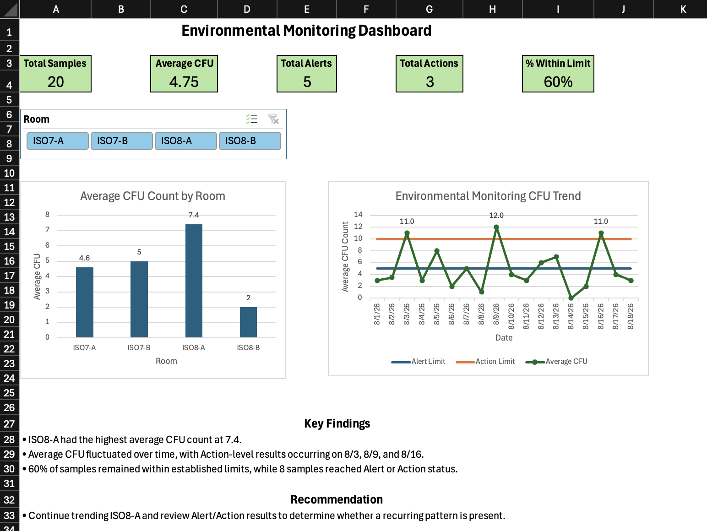

# Environmental Monitoring Data Analysis – Excel

## Project Overview

This project analyzes simulated environmental monitoring CFU data to identify trends and Alert/Action level results, compare microbial counts across cleanroom areas, and present key findings through an interactive Excel dashboard.

## Tools & Skills

- Microsoft Excel
- Excel Tables and formulas
- PivotTables and PivotCharts
- Conditional Formatting
- KPI calculations
- GETPIVOTDATA
- Data visualization and dashboard design
- Slicers and interactive filtering
- Data interpretation and trend analysis

## Dataset

This project uses a simulated environmental monitoring dataset containing 20 samples collected from August 1–18, 2026.

The dataset includes:

- Cleanroom areas: ISO7-A, ISO7-B, ISO8-A, and ISO8-B
- Sample types: Air and Surface
- CFU counts for each sample
- Alert Limit: 5 CFU
- Action Limit: 10 CFU
- Sample status: Within Limit, Alert, or Action

The dataset was created for portfolio and educational purposes and does not contain proprietary or company data.

## Analysis Performed

The analysis included:

- Classified each sample as Within Limit, Alert, or Action based on established CFU limits
- Calculated KPIs including total samples, average CFU, Alert results, Action results, and percentage within limits
- Compared average CFU counts across cleanroom areas
- Compared average CFU counts between Air and Surface samples
- Analyzed CFU trends over the monitoring period
- Visualized Alert and Action limits alongside CFU trends
- Created an interactive dashboard with a room slicer for filtering

## Key Findings

- ISO8-A had the highest average CFU count at 7.4.
- Action level results occurred on 8/3, 8/9, and 8/16.
- 60% of samples remained within established limits, while 8 samples reached Alert or Action status.
- Air samples had a slightly higher average CFU count (4.9) than Surface samples (4.6), although the difference was small.
- CFU counts fluctuated throughout the monitoring period, with no consistent upward or downward trend.

## Dashboard

## Recommendation

Based on the results, continued monitoring of ISO8-A is recommended along with a review of Alert and Action level results to determine whether recurring patterns are present and whether additional sampling or cleaning may be warranted.
